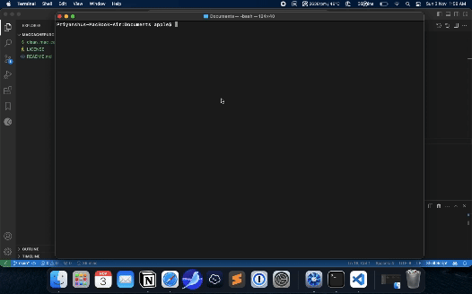

# 🧹 MacCachePurge

[](https://opensource.org/licenses/MIT)
[](https://www.apple.com/macos)
[](https://www.gnu.org/software/bash/)

> A powerful and user-friendly command-line tool to efficiently clean cache and free up space on your Mac.

## ✨ Features

- 🚀 Quick and efficient cache cleaning
- 💻 Cleans both user and system caches
- 🗑️ Empty trash functionality
- 📊 Shows space to be freed before cleaning
- 🎨 Colorful and interactive interface
- 🛡️ Secure operation with sudo handling

## 📋 Prerequisites

- macOS operating system
- Terminal access
- Administrator (sudo) privileges

## 🔧 Installation

1. Download the script:
```bash
curl -O https://raw.githubusercontent.com/phostilite/maccachepurge/main/clean_mac_cache
```

2. Make it executable:
```bash
chmod +x clean_mac_cache
```

3. Move to system bin (optional):
```bash
sudo mv clean_mac_cache /usr/local/bin/
```

## 🚀 Usage

Simply run the script in your terminal:
```bash
clean_mac_cache
```

### 📺 Demo


*(You can add a demo gif/video showing the script in action)*

### 🖼️ Sample Output
```
Cache Cleaning Tool
================================================
Analyzing directories...

The following will be cleaned:
------------------------------------------------
User Cache (~Library/Caches): 2.1GB
System Cache (/Library/Caches): 1.3GB
Trash: 500MB
------------------------------------------------
Total space to be freed: 3.9GB

Do you want to proceed with cleaning? (y/n):
```

## ⚠️ Security Considerations

- The script requires sudo privileges for cleaning system caches
- All operations are performed on standard cache directories only
- Confirmation is required before any deletion
- No sensitive system files are touched
- Sudo session is managed securely

## 🤝 Contributing

1. Fork the repository
2. Create your feature branch (`git checkout -b feature/amazing-feature`)
3. Commit your changes (`git commit -m 'Add some amazing feature'`)
4. Push to the branch (`git push origin feature/amazing-feature`)
5. Open a Pull Request

## 📜 License

This project is licensed under the MIT License - see the [LICENSE](LICENSE) file for details.

## 👤 Author

**Priyanshu Sharma**

- GitHub: [@phostilite](https://github.com/phostilite)

## 🙏 Acknowledgments

- Inspired by the need for a simple, efficient cache cleaning solution
- Thanks to the macOS community for testing and feedback

## 📝 Note

Always review the directories that will be cleaned before proceeding. While this script is designed to be safe, it's good practice to understand what you're cleaning.